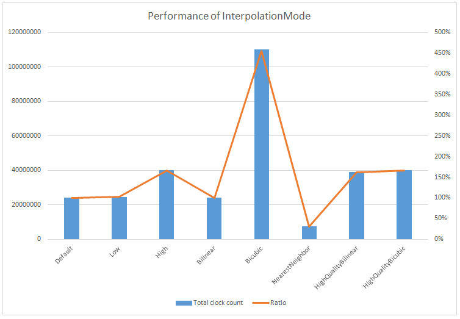

# PerformanceInterpolationMode
Repository to measure performance of InterpolationMode

# Result
NearestNeighbor is the fastest.

|Mode|Total clock count|Ratio|
|:-:|:-:|:-:|
|Default|24130822|100%|
|Low|24676698|102%|
|High|40063964|166%|
|Bilinear|24049502|100%|
|Bicubic|110087971|456%|
|NearestNeighbor|7526678|31%|
|HighQualityBilinear|38939439|161%|
|HighQualityBicubic|40209789|167%|

